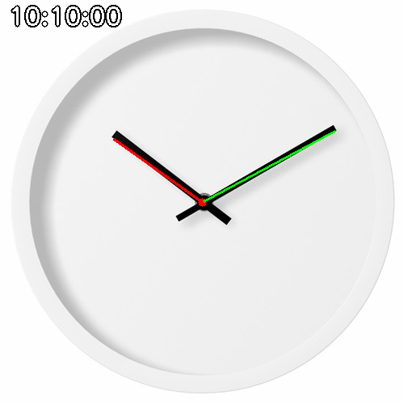
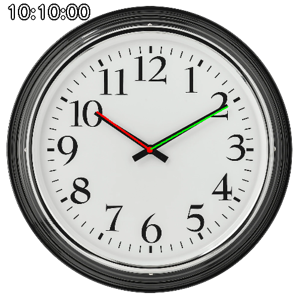

# 🕰️ Analog Clock Time Detector

This project provides a solution for detecting the time displayed on an analog clock from an image. It leverages image processing techniques using OpenCV to identify clock hands, calculate their angles, and convert these angles into corresponding hour, minute, and second values.

🚀 **Key Features**

*   **Image Preprocessing:** Resizes, converts to grayscale, and applies Gaussian blur to enhance image quality for better edge detection.
*   **Edge and Line Detection:** Employs Canny edge detection and the Probabilistic Hough Transform to identify lines representing clock hands.
*   **Angle Calculation:** Computes the angles of the detected clock hands relative to the clock center.
*   **Time Conversion:** Converts hand angles into accurate hour, minute, and second values.
*   **OpenCV Integration:** Utilizes OpenCV for robust image processing and manipulation.

📦 **Getting Started**

### Prerequisites

*   Python 3.x
*   pip package installer

### Installation

1.  Clone the repository:

    ```bash
    git clone <repository_url>
    cd <repository_directory>
    ```

2.  Install the required packages:

    ```bash
    pip install opencv-python numpy
    ```

### Running Locally

1.  Navigate to the project directory.
2.  Update the path to the clock image in the script.

    ```bash
    # Call the function
    path_to_image = "clock.png"
    detect_time(path_to_image)
    ```

4.  Run the `detect_time.py` script:

📸 **Examples**

 
